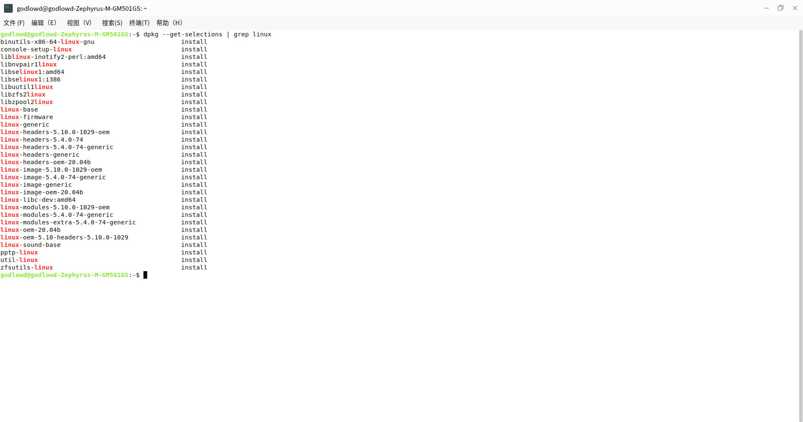
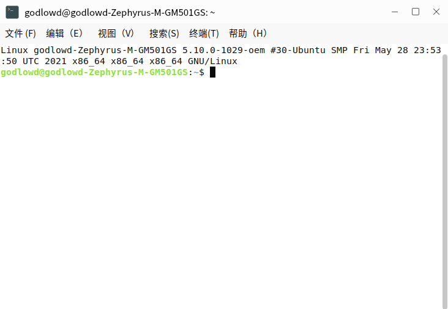
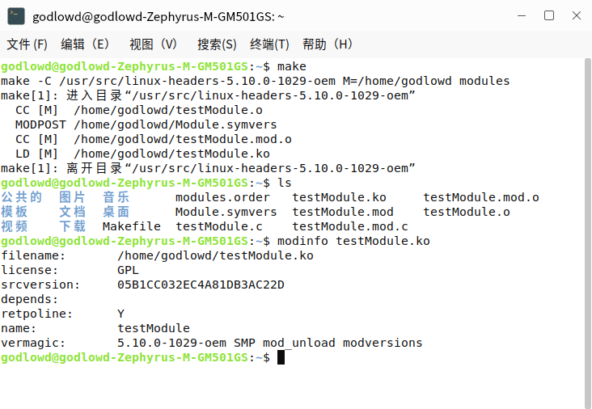
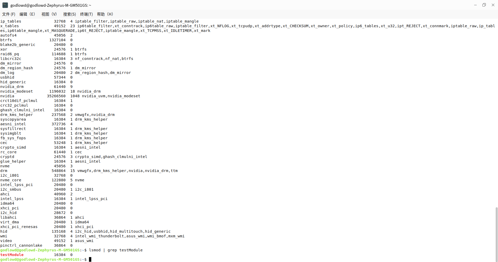

# Linux内核开发

优麒麟和Ubuntu，Red Hat等其他的Linux发行版一样，都是在**Linux**的内核基础之上对其进行修改。因此这次我们介绍一下如何针对内核进行一些简单的开发，并运行起编辑后的内核。

## Linux内核的获取

Linux开源的特性让其源代码可以在互联网上很方便的获取到，通过访问https://www.kernel.org/, 可以获取到最新的以及以往的内核源代码。


可以看到现在的最新版本是``5.13.9``。点击黄色按钮``Latest Release``即可下载。

## 编译内核前需要做的准备

在编译内核前有几个软件是必须准备好的，不然我们也不能凭空编译一个内核对不对

### GCC

全称为：``GNU Compiler Collection``，是Linux的系统中常用的编译器的一种，一般会预装在系统中，通过指令``gcc -V``可以查看当前系统中GCC的版本。如果没有的话可以通过``sudo apt-get install gcc``来安装。

### make

make是一个源代码维护工具，它能自动检测出需要重新编译的源文件并根据你设定的编译规则去重新编译程序。通常情况下需要一个**MAKEFILE**文件才能正常的使用make命令。同样的，通过``sudo apt-get install make``来安装make命令。

### 其他

其他的一些依赖如``kernel-kbuild``,``build-essential``,``kernel-package``, ``initrd-tools``都可以使用``sudo apt-get install package_name``的方法来安装，package_name即为要安装的依赖名。

## 安装一个内核模块

### 查看系统版本

 我们查看一下计算机中已经安装好的模块，在终端输入``dpkg --get-selections | grep linux``。 显示如下图所示



再在终端输入``uname -rma``，查看内核版本号等信息，如下图所示：



可以看到现在使用的优麒麟系统版本号为``5.10``。下面我们动手安装一个内核进我们的操作系统

### 编写模块代码

```c
#include<linux/module.h>
#include<linux/kernel.h>
#include<linux/init.h>

static int __init lkp_init(void)
{
	printk("Hello, World! It's Ukylin\n");
	return 0;
}

static void __exit lkp_cleanup(void)
{
	printk("See you\n");
}

module_init(lkp_init);	// 注册模块
module_exit(lkp_cleanup);	// 注销模块
MODULE_LICENSE("GPL"); 	//告诉内核该模块具有GNU公共许可证
```
在任意位置创建一个名为``testModule.c``的文件，将上述代码的内容复制进去，对源代码解释如下：
``module.h``中包含了对模块的结构定义以及模块的版本控制, ``kernel.h``含有内核函数，如``printk``
``init.h``包含宏``__init``和``__exit``，``__init``告诉编译器，这个函数或者变量仅用于初始化，编译程序将所有的``__init``代码存储到特殊的内存段中，初始化结束后，内存被释放
``module_init()``和``module_exit()``，向内核注册和注销模块提供新功能

### 编写MAKEFILE

之前做过C语言相关开发的同学应该见过在工程中有一个名为``MAKEFILE``或者``makefile``的文件。而这个文件有什么用呢？``MAKEFILE``文件通过一组约定好的语法规则，执行一定的操作。主要用来编译程序。
在与``testModule.c``同级的目录下创建一个``makefile``文件，使用``vim``,``gedit``,``touch``均可。输入以下指令

```
# Makefile 4.0
obj-m := testModule.o
CURRENT_PATH := $(shell pwd)
LINUX_KERNEL := $(shell uname -r)
LINUX_KERNEL_PATH := /usr/src/linux-headers-$(LINUX_KERNEL)

all:
	make -C $(LINUX_KERNEL_PATH) M=$(CURRENT_PATH) modules
clean:
	make -C $(LINUX_KERNEL_PATH) M=$(CURRENT_PATH) clean

```

``:=``是赋值的符号,``all``和``clean``是make命令可以识别的子命令,``module.o``是要生成的模块名，需要注意的是C语言文件的名字和要生成的模块的名字需要保持一致，否则make的时候会报错

### 编译

在``Makefile``的目录下输入命令``make``，等待执行即可




可以看到在当前目录下生成的模块相关的文件以及模块的信息，通过``modinfo``命令获取到。

### 添加模块

在终端输入``insmod module.ko``添加模块

### 查看添加进的模块



在终端输入``insmod | grep testModule``查看我们添加进的模块，``insmod``命令列出系统中的所有模块， ``grep testModule``列出名字为``testModule``的模块。可以看到内核成功安装。

